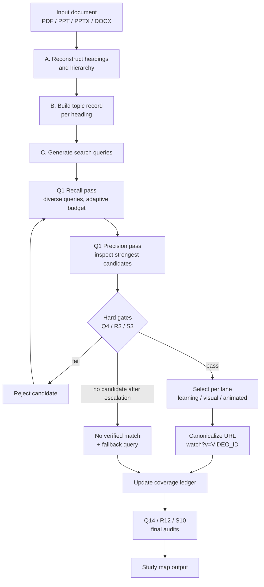

# AmelTech Youtube Class

**Version 1.1.0** · MIT License · by AmelTech Lab's

A skill-based plugin that reads educational material (PDF, PPT, PPTX, DOCX), finds every meaningful heading, and matches each one to a **verified, direct YouTube video** — with separate lanes for a normal learning resource, a visual resource, and an animated/cartoon resource.

The plugin contains no executable code. All logic lives in one instruction file, `skills/youtube-class-workflow/SKILL.md`, which the host assistant follows. This README explains how that logic is structured.

---

## Contents

1. [What it does](#what-it-does)
2. [Repository layout](#repository-layout)
3. [Installation (ChatGPT / Codex plugin upload)](#installation)
4. [Algorithm overview](#algorithm-overview)
5. [Stage-by-stage logic](#stage-by-stage-logic)
6. [The three resource lanes](#the-three-resource-lanes)
7. [Gates and rejection rules](#gates-and-rejection-rules)
8. [Verification states](#verification-states)
9. [Output contract](#output-contract)
10. [Failure handling](#failure-handling)
11. [Internal data structures](#internal-data-structures)
12. [Version history](#version-history)
13. [Known limitations](#known-limitations)
14. [License](#license)

---

## What it does

Given a study document, the plugin:

1. Reconstructs the heading hierarchy in original order.
2. Builds a context record for each heading (definitions, formulas, examples, learning intent).
3. Searches for YouTube videos, one heading at a time.
4. Checks each candidate against hard gates (subject, scope, intent, URL integrity, visual evidence).
5. Returns a study map where every heading has a direct canonical video link or an explicit "no verified match" status with a fallback search query.

It never invents URLs, titles, channels or verification claims.

---

## Repository layout

```
ameltech-youtube-class/
├── plugin.json                         # Manifest (agent-plugins schema + com.openai interface)
├── .codex-plugin/
│   └── plugin.json                     # Manifest (Codex plugin format, points to ./skills)
├── skills/
│   └── youtube-class-workflow/
│       └── SKILL.md                    # The complete workflow / algorithm
├── README.md
└── LICENSE
```

| File | Purpose |
|---|---|
| `plugin.json` | Name, version, description, author, and the `com.openai` interface block (display name, descriptions, category `Education`, capability `Interactive`, three default prompts). |
| `.codex-plugin/plugin.json` | Same interface metadata plus `"skills": "./skills"`, which tells the host where to find the skill. |
| `SKILL.md` | YAML front matter (`name: youtube-class-workflow`, trigger description) followed by the workflow sections A–S. |

---

## Installation

The package is already structured for plugin upload: the folder `ameltech-youtube-class/` contains both manifests and the `skills/` directory.

1. Download the ZIP.
2. Upload it through your ChatGPT / Codex plugin installation flow.
3. Start a chat, attach a PDF, PPT, PPTX or DOCX, and use one of the default prompts, for example:
   - *Analyze this study material and find the best YouTube video for every heading.*
   - *Map each document heading to a closely matching YouTube learning video and explain the match.*
   - *Create a heading-by-heading YouTube study map from this document.*

**Web access:** live verification needs the host to have web search/browsing enabled. Without it, the plugin is designed to return search-ready queries instead of direct links (see [Failure handling](#failure-handling)).

For GitHub, commit the folder contents as-is. `LICENSE` is detected automatically.

---

## Algorithm overview



The pipeline is **per heading**, not per chapter. A heading is a separate learning subject unless it is purely navigation text.

---

## Stage-by-stage logic

### A. Input and document reconstruction
- Reads the actual content, not just the filename.
- Detects title, chapters, sections, subsections, slide titles, numbered headings and meaningful topic labels.
- Rebuilds the hierarchy from numbering, structure, slide order and local context, and preserves original order.
- Ignores page numbers, repeated headers/footers, boilerplate and decorative labels.
- For scanned or partly extracted files, uses the page/visual representation to recover heading text rather than guessing.

### B. Heading understanding engine
Each heading gets a compact **topic record**:

| Field | Content |
|---|---|
| exact heading | Original wording |
| parent | Chapter / section |
| context | Nearby definitions and key terms |
| math | Equations, variables, units |
| examples | Problems, figures, captions, practical context |
| learning intent | theory / derivation / numerical / practical / design / review |
| vocabulary | Synonyms and abbreviations |

Repeated headings are disambiguated using their parent section and local context.

### C. Query generation
A query combines the normalized heading, the most discriminative terms from its content, an instructional intent word when useful, and syllabus vocabulary. Noise and over-broad wording are removed. Rare, discriminative terms are weighted above generic words such as "introduction", "lesson", "chapter" or "tutorial" (Q5).

### D–E. Discovery, verification and selection
Candidates come from current YouTube/web results. Before selection, the plugin checks that:
- the result is a video, not a channel, search page or playlist;
- title and channel are consistent;
- the URL is real and belongs to the chosen result;
- topic coverage and instructional depth match the heading.

Popularity is never a reason to choose a video by itself.

### F–G. Relevance, duplicates and ambiguity
- Internal comparison across heading match, body concepts, syllabus alignment, technical specificity, intent, completeness, source quality, and freshness (only when the subject is time-sensitive). No numeric scores are shown.
- A video may be reused across headings only if it genuinely covers each one's distinct scope. Duplicates are detected by video ID, not title similarity (Q7).
- Multi-concept headings: first look for one combined video; if none covers the full scope, split into named subtopics, each with its own video.
- Ambiguous headings: resolve from surrounding text first; if still ambiguous, search each interpretation separately (Q8).

### Q. Two-stage retrieval (v1.0.8)
- **Recall pass:** a few diverse queries (exact title, normalized terms, synonym/abbreviation, context + topic, intent + topic, animation + topic). Only one dimension changes at a time to avoid query drift (Q6).
- **Precision pass:** inspect the strongest candidates and eliminate any that fail subject, scope, intent or URL checks.
- **Adaptive budget (Q2):** start with one focused query per heading; expand only when results are missing, ambiguous, off-topic, multi-concept, or the animation requirement is unmet. Stop as soon as a candidate clears every mandatory gate.
- **Efficiency principle (Q15):** optimize evidence gained per search. Reuse topic records, queries and negative evidence within a task, but never reuse a video match without rechecking it against the new heading.

### R. Visual-resource engine (v1.0.9)
Adds the visual lane with two independent gates (see below) and a five-step query ladder:

1. `"exact heading" visual explanation`
2. `"exact heading" animated explanation`
3. `"exact heading" diagram animation`
4. normalized subject + rare context term + visual intent
5. local-language equivalent + visual intent (when useful)

### S. Direct video resolution (v1.1.0)
Adds a strict direct-link requirement. Candidates are found with a `site:youtube.com/watch` ladder:

1. exact heading
2. exact heading + key context
3. normalized subject/synonym + intent
4. visual/animated qualifier + exact subject
5. alternative wording or local language

A search-results page is **discovery evidence only**. If a search returns only a results page, the plugin uses it to identify candidate titles, then resolves a concrete video page.

---

## The three resource lanes

Every meaningful heading is evaluated in three independent lanes (R1). One lane never silently substitutes for another.

| Lane | Meaning | Requirement |
|---|---|---|
| **Learning resource** | Normal lecture / tutorial / worked-example match | Passes subject gate |
| **Visual resource** | A video where visual representation materially explains the subject (animation, labeled diagrams, step-by-step visuals, simulation, illustrated explanation, essential demonstration) | Passes subject gate **and** visual gate |
| **Animated/cartoon resource** | A visual match with evidence of animation, cartoon, or animated diagrams | Passes subject gate **and** animation evidence |

A visual resource may be non-animated if it is the clearest verified visual explanation. Talking-head videos with incidental slides do not qualify unless the evidence shows the visuals are central to teaching the subject (R2).

**Domain preferences**

| Domain | Preferred visual evidence |
|---|---|
| Mathematics | Graphing, geometric animation, derivation visualization, stepwise worked visuals |
| Physics / engineering | Schematics, circuit animation, motion diagrams, field/flow views, simulation, demonstrations |
| Natural sciences | Labeled process diagrams, biological/earth-science animation, system simulation |
| Procedural / design | Step-by-step screen demos, CAD/simulation walkthroughs |

Derivation headings favor derivation videos; numerical headings favor worked examples; practical headings favor lab/demonstration videos (J).

---

## Gates and rejection rules

### Subject gate (Gate A)
Exact or unambiguous subject match, local-context match, correct discipline and terminology, correct learning intent, and required formula/method/process coverage.

### Visual gate (Gate B)
Accessible evidence supports a visual teaching format, the visual is relevant rather than decorative, and for the animated lane animation/cartoon evidence is present. Subject match and format match are tested separately (Q9): a video can be subject-verified but not format-verified.

A candidate passes a lane only when **all gates required for that lane** pass.

### Hard rejection (Q4, R7, S3)
A candidate is rejected immediately if it is:
- not a specific video (channel, playlist, topic page, search page, Google/Bing result);
- a malformed or unverifiable URL, or has no recoverable video ID;
- a subject mismatch or wrong discipline;
- the wrong instructional intent where intent is explicit and material;
- a general chapter overview when a specific heading exists;
- about a nearby but different mechanism, formula, process or device;
- animated only decoratively, or its animation claim is unsupported;
- inconsistent across sources (title/channel cannot be tied to one video identity).

### Evidence hierarchy (Q3, R4)
1. Direct video page/result metadata
2. Title + channel + description/transcript
3. Authoritative page identifying the same video (and its format)
4. Search results — discovery only, never sufficient proof of visual format

Weak evidence never overrides stronger contradictory evidence. Animation is never inferred from words like "visual", "easy", "explained", from a thumbnail, or from channel branding.

### Popularity tie-breaker (S4, S9)
Reach or engagement is used only as a secondary tie-breaker among candidates that already pass every gate. A niche but exact video stays eligible over a broader, more-viewed one. Exact view counts are never claimed unless checked.

### Link canonicalization (Q10, R6, S3)
Accepted links are rebuilt as `https://www.youtube.com/watch?v=VIDEO_ID` with tracking parameters removed. The displayed `video title + channel + canonical URL + verification state` must refer to the same video.

---

## Verification states

Only the weakest truthful state is used. No numeric confidence scores are shown.

**General (Q13)**
- `Verified — metadata checked`
- `Verified — description/transcript checked`
- `Partially verified`
- `Unverified`
- `No sufficiently verified match found`

**Direct-link specific (S8)**
- `Direct verified — video ID + metadata checked`
- `Direct verified — video ID + description/transcript checked`
- `Direct identified — video page found, limited metadata`
- `No verified direct video link found`

The plugin must not claim to have watched a video or confirmed its animation style unless that evidence was actually inspected (P).

---

## Output contract

Rows are returned in original document order, grouped by chapter for long documents. The newest specification (S11) uses these columns:

| No. | Heading / Subject | Existing Learning Resource | Identified Visual Resource | Animated/Cartoon Resource | Direct YouTube Video Link | Verification | Fallback Search |
|---|---|---|---|---|---|---|---|

Rules:
- **Direct YouTube Video Link** holds either one canonical `/watch?v=` URL or `No verified direct YouTube video link found`. It never holds a search URL.
- A YouTube search URL or query may appear only in **Fallback Search**.
- The existing learning resource stays visible even when no visual or animated match exists.
- After the table: **Study Sequence** (compact ordered viewing plan) and **Coverage Notes** (split headings, weak matches, unresolved headings, shared videos).
- Links are delivered proactively; the user does not need to ask for them.
- For exam/question papers, questions are mapped individually only when requested or when the structure clearly calls for it (J).
- Political or electoral material receives neutral factual topic matching only, with no ranking or scoring of candidates, parties or outcomes (L).

---

## Failure handling

| Situation | Behavior |
|---|---|
| No sufficiently relevant verified video | Output `No sufficiently verified match found` and give the exact fallback query. No unrelated filler video. |
| No verified animated video | `No verified animated match found`, plus a labeled search link/query. A search link is never labeled as a video. |
| No verified visual resource | `No verified visual-resource match found`. |
| Only a search results page is returned | Use it to discover titles, then resolve a concrete video page; if that fails, report no verified direct link and put the search URL under Fallback Search. |
| No web access | State that live verification could not be performed and supply search-ready queries instead of invented links. |
| A link cannot be safely constructed | Omit it and state the reason. |

---

## Internal data structures

These are described in the skill as internal working state. They are not shown to the user as numeric scores.

**Coverage ledger (Q12)** — one row per heading:
`heading_id`, `document_order`, `subject_scope`, `query_attempts`, `selected_video`, `verification_state`, `animated_candidate`, `animation_verification_state`, `fallback_query`, `final_status`.
A heading is not complete until every required resource field is resolved or marked unresolved.

**Candidate matrix (R10)** — per heading:
`candidate_id`, `subject_match`, `context_match`, `intent_match`, `visual_evidence`, `animation_evidence`, `url_integrity`, `source_quality`, `rejection_reason`, `final_lane`.

Learning, visual and animated query logs are kept separate (R9).

---

## Final audits

Three checklists run before delivery:

- **Q14 (study map):** heading coverage, order, resource separation, link integrity, evidence integrity, semantic integrity (no title-only false positives), duplicate justification, failure transparency, column correctness, concise usability.
- **R12 (visual):** every heading evaluated in the visual lane, gates passed separately, no unsupported animation claims, title/channel/link agree, canonical links, no merged lanes, weak matches rejected, fallback queries present, no silent omissions.
- **S10 (direct links):** each link has a concrete video ID, is canonical, is not a search/channel/playlist URL, matches the displayed title/channel and the heading subject, and satisfies the lane's visual condition. If any check fails, the URL is removed and replaced by the no-verified-link state plus a fallback search.

---

## Version history

| Version | Section | Change |
|---|---|---|
| base | A–L | Document parsing, heading engine, query generation, discovery, verification, relevance, duplicates, failure handling, output contract, domain accuracy, safety/neutrality |
| 1.0.6 | O | Per-heading subject matching, proactive links, subject decomposition, link-coverage check |
| 1.0.7 | P | Additional animated/cartoon resource kept separate from the learning resource |
| 1.0.8 | Q | Two-stage retrieval, adaptive search budget, evidence hierarchy, hard rejection gates, coverage ledger |
| 1.0.9 | R | Visual-resource lane, two independent gates, query ladder, candidate matrix |
| 1.1.0 | S | Direct YouTube video resolution, search-page rejection, `site:youtube.com/watch` ladder, direct-link field rules |

Section M is a runtime response convention: after a completed task, the assistant appends a credit line for the author as a separate paragraph, outside tables, files and metadata.

---

## Known limitations

- Quality depends on the host having live web access. Without it, results are search queries rather than verified links.
- Verification is limited to evidence the host can actually inspect (metadata, description, transcript). The plugin does not watch videos.
- `SKILL.md` has no explicit precedence rule between layers. Where output tables differ (I, P, R11, S11), the newest, S11, should be treated as the effective contract.
- Section lettering in `SKILL.md` skips from M to O (there is no N); this is cosmetic.
- Accuracy cannot be guaranteed for very niche or newly published topics.

---

## License

Released under the [MIT License](LICENSE). Copyright (c) 2026 AmelTech Lab's.

Plugin author credit: Mr. Amel Shaju.
