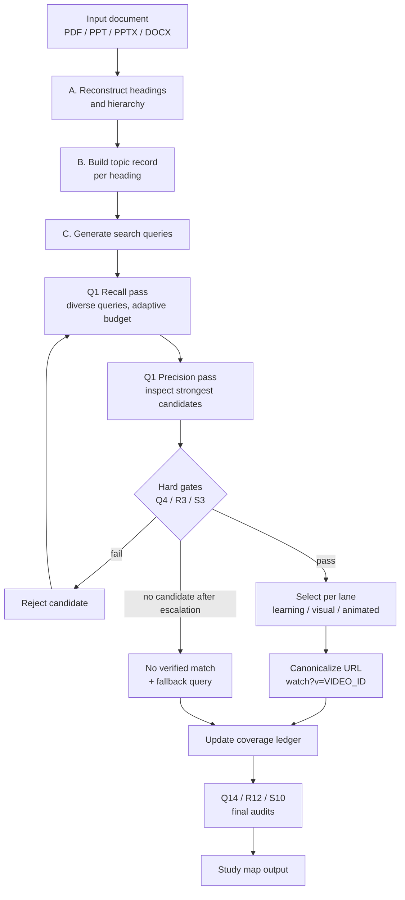
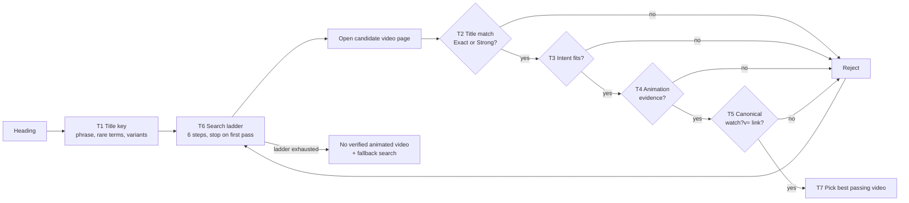
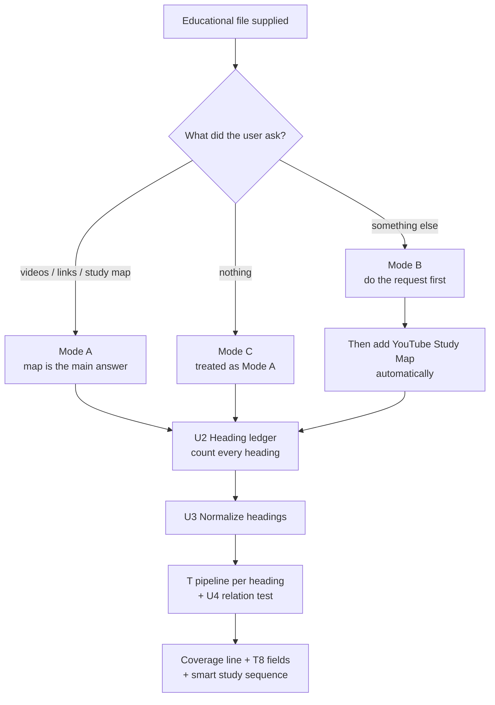
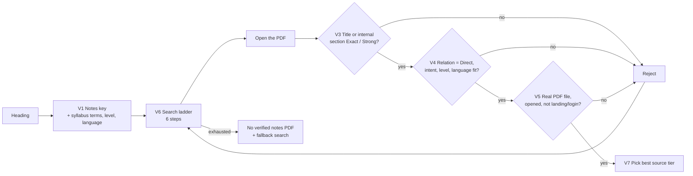
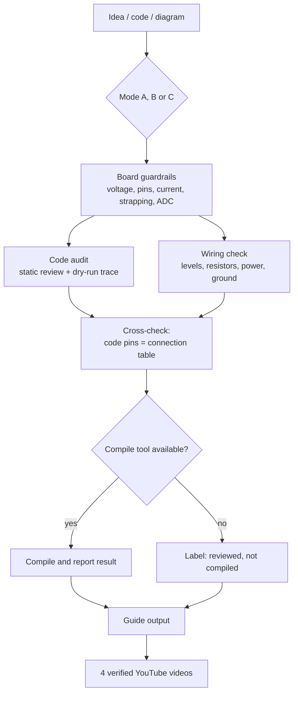

# AmelTech Youtube Class

**Version 1.5.0** · MIT License · by AmelTech Lab's

A skill-based plugin that reads educational material (PDF, PPT, PPTX, DOCX), finds every meaningful heading, and matches each one to a **verified, direct YouTube video** — with separate lanes for a normal learning resource, a visual resource, and an animated/cartoon resource.

The plugin also includes a second skill, the **Embedded Project Guide**, for Arduino, ESP32 and ESP8266 projects, code and circuit diagrams (see [Embedded Project Guide](#embedded-project-guide-arduino-esp32-esp8266)).

The plugin contains no executable code. All logic lives in two instruction files, `skills/youtube-class-workflow/SKILL.md` (study material) and `skills/embedded-project-guide/SKILL.md` (maker projects), which the host assistant follows. This README explains how that logic is structured.

---

## Contents

1. [What it does](#what-it-does)
2. [Repository layout](#repository-layout)
3. [Installation (ChatGPT / Codex plugin upload)](#installation)
4. [Algorithm overview](#algorithm-overview)
5. [Stage-by-stage logic](#stage-by-stage-logic)
6. [The three resource lanes](#the-three-resource-lanes)
7. [Gates and rejection rules](#gates-and-rejection-rules)
8. [Verification states](#verification-states)
9. [Output contract](#output-contract)
10. [Failure handling](#failure-handling)
11. [Internal data structures](#internal-data-structures)
12. [Version history](#version-history)
13. [Known limitations](#known-limitations)
14. [Embedded Project Guide (Arduino, ESP32, ESP8266)](#embedded-project-guide-arduino-esp32-esp8266)
15. [License](#license)

---

## What it does

Given a study document, the plugin:

1. Reconstructs the heading hierarchy in original order.
2. Builds a context record for each heading (definitions, formulas, examples, learning intent).
3. Searches for YouTube videos, one heading at a time.
4. Checks each candidate against hard gates (subject, scope, intent, URL integrity, visual evidence).
5. Returns a study map where every heading has the normal learning resource, **and**, separately, one direct animated/cartoon YouTube link and one direct online **notes PDF** link, each closely matching the heading, or an explicit "no verified match" status with a fallback search query.

It works **with or without a request**: if you only upload material, or ask for something else such as a summary, the heading-by-heading video map is still delivered. It never invents URLs, titles, channels or verification claims.

---

## Repository layout

```
<plugin root>/                          # archive root / GitHub repo root
├── plugin.json                         # Manifest (agent-plugins schema + com.openai interface)
├── .codex-plugin/
│   └── plugin.json                     # Manifest (Codex plugin format, points to ./skills)
├── skills/
│   ├── youtube-class-workflow/
│   │   └── SKILL.md                    # Study-material workflow (videos + notes PDFs)
│   └── embedded-project-guide/
│       └── SKILL.md                    # Arduino / ESP32 / ESP8266 project guide
├── README.md
└── LICENSE
```

| File | Purpose |
|---|---|
| `plugin.json` | Name, version, description, author, and the `com.openai` interface block (display name, descriptions, category `Education & Research`, capability `Interactive`, three default prompts). |
| `.codex-plugin/plugin.json` | Same interface metadata plus `"skills": "./skills"`, which tells the host where to find the skill. |
| `skills/youtube-class-workflow/SKILL.md` | YAML front matter (`name: youtube-class-workflow`, trigger description) followed by the workflow sections A–V. |
| `skills/embedded-project-guide/SKILL.md` | YAML front matter (`name: embedded-project-guide`) followed by the maker-project workflow, sections 0–10. |

---

## Installation

**Rule that matters most:** the plugin root must be the **repository root**. GitHub's *Code → Download ZIP* wraps the repo in one folder (`AmelTech-Youtube-Class-main/`). ChatGPT accepts exactly one plugin root, either at the archive root or inside a single top-level folder, so `plugin.json` and `skills/` must sit directly inside that folder, not one level deeper.

Correct repo root:

```
plugin.json
.codex-plugin/plugin.json      (optional for ChatGPT; plugin.json is the required manifest)
skills/youtube-class-workflow/SKILL.md
README.md
LICENSE
```

Steps:

1. Put those files at the repo root on GitHub (create files with their full path, e.g. `skills/youtube-class-workflow/SKILL.md`, if you cannot upload folders).
2. Open the repo, choose **Code → Download ZIP**.
3. In ChatGPT go to **Plugins → New Plugin**, upload that ZIP, then **Add plugin**.
4. Attach a PDF, PPT, PPTX or DOCX and use one of the default prompts:
   - *Analyze this study material and find the best YouTube video for every heading.*
   - *Map each document heading to a closely matching YouTube learning video and explain the match.*
   - *Create a heading-by-heading YouTube study map from this document.*

Common upload error: *"Agent Plugins package must contain at least one valid skill or MCP server"* means ChatGPT could not find `skills/<name>/SKILL.md` at the plugin root. Check that the folder `skills` is visible at the top level of the repo.

**Web access:** live verification needs the host to have web search/browsing enabled. Without it, the plugin returns search-ready queries instead of direct links (see [Failure handling](#failure-handling)).

---

## Algorithm overview



The pipeline is **per heading**, not per chapter. A heading is a separate learning subject unless it is purely navigation text.

---

## Stage-by-stage logic

### A. Input and document reconstruction
- Reads the actual content, not just the filename.
- Detects title, chapters, sections, subsections, slide titles, numbered headings and meaningful topic labels.
- Rebuilds the hierarchy from numbering, structure, slide order and local context, and preserves original order.
- Ignores page numbers, repeated headers/footers, boilerplate and decorative labels.
- For scanned or partly extracted files, uses the page/visual representation to recover heading text rather than guessing.

### B. Heading understanding engine
Each heading gets a compact **topic record**:

| Field | Content |
|---|---|
| exact heading | Original wording |
| parent | Chapter / section |
| context | Nearby definitions and key terms |
| math | Equations, variables, units |
| examples | Problems, figures, captions, practical context |
| learning intent | theory / derivation / numerical / practical / design / review |
| vocabulary | Synonyms and abbreviations |

Repeated headings are disambiguated using their parent section and local context.

### C. Query generation
A query combines the normalized heading, the most discriminative terms from its content, an instructional intent word when useful, and syllabus vocabulary. Noise and over-broad wording are removed. Rare, discriminative terms are weighted above generic words such as "introduction", "lesson", "chapter" or "tutorial" (Q5).

### D–E. Discovery, verification and selection
Candidates come from current YouTube/web results. Before selection, the plugin checks that:
- the result is a video, not a channel, search page or playlist;
- title and channel are consistent;
- the URL is real and belongs to the chosen result;
- topic coverage and instructional depth match the heading.

Popularity is never a reason to choose a video by itself.

### F–G. Relevance, duplicates and ambiguity
- Internal comparison across heading match, body concepts, syllabus alignment, technical specificity, intent, completeness, source quality, and freshness (only when the subject is time-sensitive). No numeric scores are shown.
- A video may be reused across headings only if it genuinely covers each one's distinct scope. Duplicates are detected by video ID, not title similarity (Q7).
- Multi-concept headings: first look for one combined video; if none covers the full scope, split into named subtopics, each with its own video.
- Ambiguous headings: resolve from surrounding text first; if still ambiguous, search each interpretation separately (Q8).

### Q. Two-stage retrieval (v1.0.8)
- **Recall pass:** a few diverse queries (exact title, normalized terms, synonym/abbreviation, context + topic, intent + topic, animation + topic). Only one dimension changes at a time to avoid query drift (Q6).
- **Precision pass:** inspect the strongest candidates and eliminate any that fail subject, scope, intent or URL checks.
- **Adaptive budget (Q2):** start with one focused query per heading; expand only when results are missing, ambiguous, off-topic, multi-concept, or the animation requirement is unmet. Stop as soon as a candidate clears every mandatory gate.
- **Efficiency principle (Q15):** optimize evidence gained per search. Reuse topic records, queries and negative evidence within a task, but never reuse a video match without rechecking it against the new heading.

### R. Visual-resource engine (v1.0.9)
Adds the visual lane with two independent gates (see below) and a five-step query ladder:

1. `"exact heading" visual explanation`
2. `"exact heading" animated explanation`
3. `"exact heading" diagram animation`
4. normalized subject + rare context term + visual intent
5. local-language equivalent + visual intent (when useful)

### S. Direct video resolution (v1.1.0)
Adds a strict direct-link requirement. Candidates are found with a `site:youtube.com/watch` ladder:

1. exact heading
2. exact heading + key context
3. normalized subject/synonym + intent
4. visual/animated qualifier + exact subject
5. alternative wording or local language

A search-results page is **discovery evidence only**. If a search returns only a results page, the plugin uses it to identify candidate titles, then resolves a concrete video page.

---

### T. Animated subject-title engine (v1.2.0)
Adds a dedicated, separate field per heading: the **Direct Animated YouTube Video**. The existing learning resource and visual resource are kept unchanged.



| Step | Rule |
|---|---|
| T1 Title key | Exact heading (numbering removed), core subject phrase, rare discriminative terms, accepted synonyms/abbreviations, parent context for disambiguation only. |
| T2 Title match | **Exact**: full core phrase in the video title. **Strong**: every rare term present and description/chapters confirm the main topic. Partial, broader (chapter/series) or narrower titles are rejected. |
| T3 Intent | Derivation needs derivation, numerical needs worked example, practical needs demonstration. An animated overview cannot stand in for a derivation. |
| T4 Animation | Needs real evidence: metadata/description/chapters, inspected transcript or preview, an explicit title statement, or an authoritative page. Channel fame, thumbnails and words like "visual" or "easy" do not count. |
| T5 Link | Valid video ID, rebuilt as `https://www.youtube.com/watch?v=VIDEO_ID`; title, channel and URL are the same video. |
| T6 Search ladder | exact heading + animation, + animated explanation, + cartoon, subject + rare term + animation, synonym + animated, local language + animation (all with `site:youtube.com/watch` where useful). |
| T7 Selection | Exact over Strong, intent, dedicated-to-heading, clarity and source quality, then reach only as a tie-breaker. |
| T10 Honesty | Never relax T2 or T4 to fill a row. No pass means the explicit no-match status plus a fallback query. |

---

### U. Proactive heading-to-video engine (v1.3.0)



| Feature | What it does |
|---|---|
| Three modes (U1) | **A** asked, **B** unasked (your task first, map appended), **C** bare upload. Same gates and fields in every mode. |
| No-clarification rule | Never blocks on a question; states an assumption in one line and delivers. |
| Skip rules | Not auto-activated for non-educational files (invoices, contracts, resumes, personal records, raw data) or when you say you don't want links. |
| Heading ledger (U2) | Counts every heading first and prints `Headings found / verified learning / verified animated / unresolved`. No silent drops; batches list what remains. |
| Smart normalization (U3) | Folds micro-headings (Example, Summary), expands vague headings (Overview, Types) with the parent subject, separates repeated headings, handles slide decks and multilingual files, detects level. |
| Relation test (U4) | Beyond the title, the video must cover the heading's core and supporting concepts. `Partial` is allowed only in the learning lane and is labeled. |
| Incremental updates (U6) | On a re-upload only new or changed headings are matched. |
| Smart study sequence (U7) | Document order with `watch before` hints; no invented durations. |
| Privacy (U9) | Queries use subject terms only, never names, IDs or other personal content. |

---

### V. Online notes PDF engine (v1.4.0)
Adds a fourth, separate lane: a **direct link to a real PDF of study notes** (lecture notes, handout, or textbook chapter) for each heading, delivered with or without a request, using the same modes as U.



| Step | Rule |
|---|---|
| V2 Source tiers | Tier 1: university/open courseware, open textbooks, standards, government, open-access repositories. Tier 2: reputable educational organizations. Tier 3: used last and labeled. Pirated copies, mirror sites, and pay/login/upload-walled files are excluded. |
| V3 Match | **Exact** or **Strong** on the PDF title or an internal section heading. Whole-book PDFs qualify only if a matching section is found and named. |
| V4 Fit | Relation must be `Direct`; intent, level, language and syllabus must fit. |
| V5 Direct PDF | A real PDF file that was opened and read for its title/section. Landing pages are reported separately as `Notes page (not PDF)`. |
| V6 Ladder | exact heading + lecture notes filetype:pdf, + site:.edu, subject + rare term + chapter pdf, synonym + notes pdf, syllabus terms + pdf, local language. |
| V8 Output | Second table: PDF title, source, match and tier, section/pages (only if read), direct PDF link, verification, fallback. |
| V9 Rules | No invented pages or sections; link, never reproduce; no personal data in queries; links may move. |

---

## The three resource lanes

Every meaningful heading is evaluated in three independent video lanes (R1). A separate notes-PDF lane (V) runs alongside them and is documented above. One lane never silently substitutes for another.

| Lane | Meaning | Requirement |
|---|---|---|
| **Learning resource** | Normal lecture / tutorial / worked-example match | Passes subject gate |
| **Visual resource** | A video where visual representation materially explains the subject (animation, labeled diagrams, step-by-step visuals, simulation, illustrated explanation, essential demonstration) | Passes subject gate **and** visual gate |
| **Animated/cartoon resource** (Direct Animated YouTube Video) | A video with real animation evidence whose title is an Exact or Strong match to the heading | Passes title-match, intent, animation and direct-link gates (T2-T5) |

A visual resource may be non-animated if it is the clearest verified visual explanation. Talking-head videos with incidental slides do not qualify unless the evidence shows the visuals are central to teaching the subject (R2).

**Domain preferences**

| Domain | Preferred visual evidence |
|---|---|
| Mathematics | Graphing, geometric animation, derivation visualization, stepwise worked visuals |
| Physics / engineering | Schematics, circuit animation, motion diagrams, field/flow views, simulation, demonstrations |
| Natural sciences | Labeled process diagrams, biological/earth-science animation, system simulation |
| Procedural / design | Step-by-step screen demos, CAD/simulation walkthroughs |

Derivation headings favor derivation videos; numerical headings favor worked examples; practical headings favor lab/demonstration videos (J).

---

## Gates and rejection rules

### Subject gate (Gate A)
Exact or unambiguous subject match, local-context match, correct discipline and terminology, correct learning intent, and required formula/method/process coverage.

### Visual gate (Gate B)
Accessible evidence supports a visual teaching format, the visual is relevant rather than decorative, and for the animated lane animation/cartoon evidence is present. Subject match and format match are tested separately (Q9): a video can be subject-verified but not format-verified.

A candidate passes a lane only when **all gates required for that lane** pass.

### Hard rejection (Q4, R7, S3)
A candidate is rejected immediately if it is:
- not a specific video (channel, playlist, topic page, search page, Google/Bing result);
- a malformed or unverifiable URL, or has no recoverable video ID;
- a subject mismatch or wrong discipline;
- the wrong instructional intent where intent is explicit and material;
- a general chapter overview when a specific heading exists;
- about a nearby but different mechanism, formula, process or device;
- animated only decoratively, or its animation claim is unsupported;
- inconsistent across sources (title/channel cannot be tied to one video identity).

### Evidence hierarchy (Q3, R4)
1. Direct video page/result metadata
2. Title + channel + description/transcript
3. Authoritative page identifying the same video (and its format)
4. Search results — discovery only, never sufficient proof of visual format

Weak evidence never overrides stronger contradictory evidence. Animation is never inferred from words like "visual", "easy", "explained", from a thumbnail, or from channel branding.

### Popularity tie-breaker (S4, S9)
Reach or engagement is used only as a secondary tie-breaker among candidates that already pass every gate. A niche but exact video stays eligible over a broader, more-viewed one. Exact view counts are never claimed unless checked.

### Link canonicalization (Q10, R6, S3)
Accepted links are rebuilt as `https://www.youtube.com/watch?v=VIDEO_ID` with tracking parameters removed. The displayed `video title + channel + canonical URL + verification state` must refer to the same video.

---

## Verification states

Only the weakest truthful state is used. No numeric confidence scores are shown.

**General (Q13)**
- `Verified — metadata checked`
- `Verified — description/transcript checked`
- `Partially verified`
- `Unverified`
- `No sufficiently verified match found`

**Direct-link specific (S8)**
- `Direct verified — video ID + metadata checked`
- `Direct verified — video ID + description/transcript checked`
- `Direct identified — video page found, limited metadata`
- `No verified direct video link found`

The plugin must not claim to have watched a video or confirmed its animation style unless that evidence was actually inspected (P).

---

## Output contract

The map starts with a coverage line (`Headings found | verified learning | verified animated | verified notes PDF | unresolved`). Rows are returned in original document order, grouped by chapter for long documents. The newest specification (T8, with delivery rules from U) uses these fields (a table, or one compact block per heading with the same fields when a table is too wide):

| No. | Heading / Subject | Existing YouTube Learning Resource | Identified Visual Resource | Direct Animated Video Title | Channel | Title Match | Animation Evidence | Direct Animated YouTube Link | Verification | Fallback Search |
|---|---|---|---|---|---|---|---|---|---|---|

Rules:
- **Existing YouTube Learning Resource** is produced by the original workflow and is never altered or replaced by the animated field.
- **Direct Animated YouTube Link** holds either one canonical `/watch?v=` URL of a video that passed T2-T5, or `No verified animated video with strong title match found`. It never holds a search URL, a partial title match, or a non-animated video.
- **Title Match** is `Exact` or `Strong`. **Animation Evidence** names the evidence type used.
- A YouTube search URL or query may appear only in **Fallback Search**, and only when no verified animated video was found.
- The notes lane (V8) is delivered as a **second table** after the video table, with these fields:

| No. | Heading / Subject | Notes PDF Title | Source / Publisher | Match | Matching Section or Pages | Direct PDF Link | Verification | Fallback Search |
|---|---|---|---|---|---|---|---|---|

- **Direct PDF Link** holds one verified direct PDF URL or `No verified notes PDF with strong match found`. It never holds a search page, listing, landing page or login-walled file.
- Page numbers and section names appear only when they were read in the opened PDF.
- If you ask for only notes or only videos, only that lane is delivered.

After the tables: **Study Sequence** (compact ordered viewing plan) and **Coverage Notes** (headings with no animated match, split headings, shared videos, animated video equal to the learning resource).
- Links are delivered proactively; the user does not need to ask for them.
- For exam/question papers, questions are mapped individually only when requested or when the structure clearly calls for it (J).
- Political or electoral material receives neutral factual topic matching only, with no ranking or scoring of candidates, parties or outcomes (L).

---

## Failure handling

| Situation | Behavior |
|---|---|
| No notes PDF passes the match and direct-PDF gates | `No verified notes PDF with strong match found` plus a fallback query. A reputable landing page may be listed as `Notes page (not PDF)`. |
| No animated video passes the title-match and animation gates | `No verified animated video with strong title match found` plus a fallback search query with animation terms. The learning resource stays visible. |
| No sufficiently relevant verified video | Output `No sufficiently verified match found` and give the exact fallback query. No unrelated filler video. |
| No verified animated video | `No verified animated match found`, plus a labeled search link/query. A search link is never labeled as a video. |
| No verified visual resource | `No verified visual-resource match found`. |
| Only a search results page is returned | Use it to discover titles, then resolve a concrete video page; if that fails, report no verified direct link and put the search URL under Fallback Search. |
| No web access | State that live verification could not be performed and supply search-ready queries instead of invented links. |
| A link cannot be safely constructed | Omit it and state the reason. |

---

## Internal data structures

These are described in the skill as internal working state. They are not shown to the user as numeric scores.

**Coverage ledger (Q12)** — one row per heading:
`heading_id`, `document_order`, `subject_scope`, `query_attempts`, `selected_video`, `verification_state`, `animated_candidate`, `animation_verification_state`, `fallback_query`, `final_status`.
A heading is not complete until every required resource field is resolved or marked unresolved.

**Candidate matrix (R10)** — per heading:
`candidate_id`, `subject_match`, `context_match`, `intent_match`, `visual_evidence`, `animation_evidence`, `url_integrity`, `source_quality`, `rejection_reason`, `final_lane`.

Learning, visual and animated query logs are kept separate (R9).

---

## Final audits

Six checklists run before delivery:

- **Q14 (study map):** heading coverage, order, resource separation, link integrity, evidence integrity, semantic integrity (no title-only false positives), duplicate justification, failure transparency, column correctness, concise usability.
- **R12 (visual):** every heading evaluated in the visual lane, gates passed separately, no unsupported animation claims, title/channel/link agree, canonical links, no merged lanes, weak matches rejected, fallback queries present, no silent omissions.
- **V10 (notes lane):** every heading has a notes link or status, PDFs were opened and judged on real title or section, no search/landing/login/shortened links in the direct field, Exact or Strong with `Direct` relation, page pointers only where read, source tiers stated, shared PDFs list different sections, scope instruction honored, no personal data or long extracts.
- **U10 (proactive delivery):** ledger count equals rows, correct mode, requested task done first in Mode B, relation test recorded, no personal data in queries, no clarifying question delaying delivery.
- **T11 (animated lane):** both fields present for every heading, canonical links, title tier judged on the real title, genuine animation evidence, learning resource unchanged, no search URL in the direct field, matching title/channel/URL, intent and level match, repeats justified, fallbacks only where nothing verified.
- **S10 (direct links):** each link has a concrete video ID, is canonical, is not a search/channel/playlist URL, matches the displayed title/channel and the heading subject, and satisfies the lane's visual condition. If any check fails, the URL is removed and replaced by the no-verified-link state plus a fallback search.

---

## Version history

| Version | Section | Change |
|---|---|---|
| base | A–L | Document parsing, heading engine, query generation, discovery, verification, relevance, duplicates, failure handling, output contract, domain accuracy, safety/neutrality |
| 1.0.6 | O | Per-heading subject matching, proactive links, subject decomposition, link-coverage check |
| 1.0.7 | P | Additional animated/cartoon resource kept separate from the learning resource |
| 1.0.8 | Q | Two-stage retrieval, adaptive search budget, evidence hierarchy, hard rejection gates, coverage ledger |
| 1.0.9 | R | Visual-resource lane, two independent gates, query ladder, candidate matrix |
| 1.1.0 | S | Direct YouTube video resolution, search-page rejection, `site:youtube.com/watch` ladder, direct-link field rules |
| 1.5.0 | new skill | Added `embedded-project-guide`: Arduino, ESP32 and ESP8266 project design, code audit and repair, circuit-diagram analysis, connection tables, beginner step-by-step guide, limitations, mistake-avoidance notes, troubleshooting, and four verified YouTube videos. Study-material skill unchanged. |
| 1.4.0 | V | Online study-notes PDF lane: strict Exact/Strong match on PDF title or internal section, mandatory opened-PDF check, source-quality tiers, 6-step notes search ladder, separate notes table, copyright and honesty rules. Works with or without a request. All earlier gates unchanged. |
| 1.3.0 | U | Proactive delivery with or without a request (modes A/B/C), heading ledger and coverage line, smart heading normalization, relation test, incremental updates, smart study sequence, privacy rules. All T gates unchanged. |
| 1.2.0 | T | Dedicated Direct Animated YouTube Video field: strict Exact/Strong title-match gate, mandatory animation evidence, 6-step animated search ladder, new output contract (T8) and precedence rule. Existing learning resource unchanged. |
| 1.1.1 | — | Packaging fix only: category set to `Education & Research`, short description shortened, `license` added to `plugin.json`. `SKILL.md` unchanged. |

Section M is a runtime response convention: after a completed task, the assistant appends a credit line for the author as a separate paragraph, outside tables, files and metadata.

---

## Known limitations

- Quality depends on the host having live web access. Without it, results are search queries rather than verified links.
- Verification is limited to evidence the host can actually inspect (metadata, description, transcript). The plugin does not watch videos.
- Where output tables in earlier layers differ (I, P, R11, S11), Section T0/T8 now states that T8 is the effective layout.
- Automatic delivery without a request depends on the host choosing to load the skill. The skill description is written to trigger on any study-material upload, but the host makes the final decision.
- Notes PDF verification needs a host that can open PDFs from the web. Without that, the plugin returns search-ready queries instead of direct links. Links may move or disappear after they are checked, and files behind a login or payment are not offered as direct links.
- The Embedded Project Guide cannot compile code unless the host provides a build tool with the needed board packages and libraries. Without one, code is labeled `Reviewed against checklist - not compiled`. No process can promise code that is free of every possible error; the skill reports exactly what was checked.
- Hardware facts (pin maps, current limits, ADC behavior) can differ between board variants and core versions. The skill states its assumptions and asks the user to confirm against the exact board's pinout.
- Video verification confirms the video page, title and channel, not that the video's circuit or code is correct.
- Strict gates mean some headings will honestly return "No verified animated video"; this is intended. Niche topics often have no animated video with a matching title.
- Section lettering in `SKILL.md` skips from M to O (there is no N); this is cosmetic.
- Accuracy cannot be guaranteed for very niche or newly published topics.

---

## Embedded Project Guide (Arduino, ESP32, ESP8266)

A second skill in the same plugin. It turns a project idea, an uploaded sketch, or a circuit diagram into a complete, beginner-friendly build guide. It does not promise "zero errors". It reduces mistakes with a fixed checking process and tells you exactly what was and was not verified.

### Inputs (three modes, detected automatically)
| Mode | You provide | The skill does |
|---|---|---|
| A | A project idea | Chooses the board and parts, designs the wiring, writes and checks the code. |
| B | Code (upload or paste) | Audits it, fixes errors with the smallest changes, explains each change, returns the full corrected sketch. A bare upload is audited too. |
| C | Circuit diagram, schematic or wiring photo | Lists what it can read, flags anything unclear instead of guessing, checks the electrical sense, converts it to a connection table. |

No clarifying questions block delivery: assumptions are stated in a short block. Default boards are Arduino Uno, ESP32 DevKit (WROOM-32) and ESP8266 NodeMCU / Wemos D1 mini.



### What the guide always contains
1. Project summary and assumptions (board, core version, voltage)
2. Safety first (mains voltage handled with strong warnings)
3. Parts list
4. Connection tables: a power table and a signal table, with wire numbers, board pin labels, the pin number used in the code, and "Do NOT connect" traps
5. Step-by-step beginner guide with an expected result after each step (IDE, board package, driver, libraries, wiring, upload, test)
6. Complete, commented, copy-paste code with placeholders for Wi-Fi secrets
7. How the code works (every function in simple words)
8. Functions and features table
9. Limitations
10. Important notes to avoid mistakes
11. Troubleshooting table
12. The four best-matching YouTube videos
13. What was checked and a short self-test checklist
14. Optional next steps

### Error-reduction process
| Check | What it catches |
|---|---|
| Board guardrails | 5 V into 3.3 V pins, input-only and flash pins, ESP32 ADC2 with Wi-Fi, strapping pins, ESP8266 D-label versus GPIO confusion, unsafe loads on logic pins, missing flyback diodes, LED resistor math |
| Static code review | Syntax, includes, wrong pins, overflow of `millis()`, blocking delays, ISR rules, `String` and memory use, baud mismatch, Wi-Fi reconnect, library or core mismatch (for example ESP32 core 3.x PWM API) |
| Dry-run trace | Walks `setup()` and two passes of `loop()` with sample inputs |
| Code-to-table cross-check | Every pin in the code appears in the table and the reverse, with identical numbers |
| Compile (when a tool is available) | Real compiler errors for the stated board and core |

### Verification labels
`Compiled OK - board, core version, and libraries named`, `Reviewed against checklist - not compiled`, `Wiring checked against datasheet or pinout`, `Wiring checked from general knowledge - confirm with your board's pinout`, `Not verified`. The weakest truthful label is always used, and the user is told to press Verify in the Arduino IDE before uploading.

### The four YouTube videos
Four distinct, best-first matches for the project, board family and exact main parts, spread over roles when good matches exist (full build, module/library wiring, code or setup, troubleshooting or variant). Each must be a real video page, inspected for its true title, channel and description, shown as a canonical `watch?v=` link. If fewer than four pass, only the verified ones are listed with a labeled search query for each gap; nothing is padded. Every list carries the note that videos may use different pins or code, so the guide's own table and code should be followed together.

### Boundaries
No help with jammers, network disruption, covert tracking, interception or security bypass. Mains-voltage wiring is never presented as a beginner task. Queries contain project and component terms only. Credentials are never written into code.

---

## License

Released under the [MIT License](LICENSE). Copyright (c) 2026 AmelTech Lab's.

Plugin author credit: Mr. Amel Shaju.
